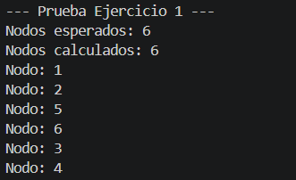
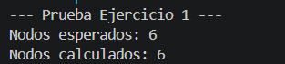
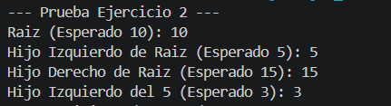
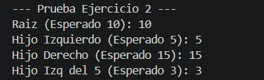
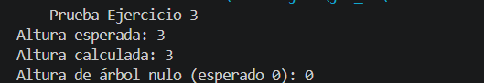
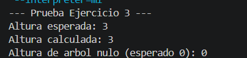
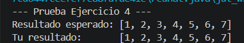
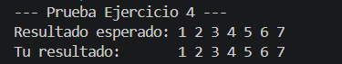
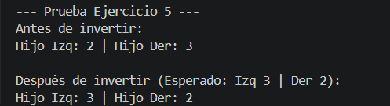
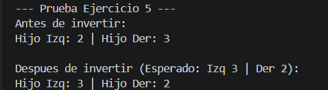

# Práctica de Estructuras de Datos: Árboles

El objetivo de este repositorio es proporcionarles un entorno práctico donde puedan aplicar los conceptos teóricos vistos en clase relacionados con árboles N-arios, árboles binarios, recorridos y transformaciones.

## Objetivos de Aprendizaje

Al completar estos ejercicios, serán capaces de:
1. Comprender y manipular la estructura básica de nodos con múltiples hijos y nodos binarios.
2. Implementar la lógica de inserción en un Árbol Binario de Búsqueda (BST).
3. Utilizar la recursividad para calcular métricas estructurales, como la profundidad máxima.
4. Extraer datos mediante recorridos estándar (In-Order).
5. Modificar la estructura subyacente de los punteros para transformar un árbol.

## Estructura del Repositorio

El repositorio contiene 5 ejercicios, cada uno debe ser hecho en c++ y java

1. Ejercicio 1: Árboles Básicos (Conteo de nodos en árboles N-arios).
2. Ejercicio 2: Árbol Binario (Inserción en BST).
3. Ejercicio 3: Árbol Binario (Cálculo de profundidad máxima).
4. Ejercicio 4: Recorridos (Implementación de In-Order).
5. Ejercicio 5: Transformación (Inversión o árbol espejo).

## Instrucciones para el Desarrollo

1. Dentro de cada archivo encontrarán la estructura básica de las clases (o structs) y la definición de un método específico que deben completar. 
2. Localicen el comentario `TODO: Implementa tu lógica aquí`. Esa es la única sección del código que necesitan modificar.
3. No es necesario modificar el método `main`. Este método ya contiene la construcción de un árbol de prueba y las impresiones necesarias para validar que su algoritmo funciona correctamente.
4. Su objetivo es lograr que, al ejecutar el código, los resultados calculados coincidan con los resultados esperados impresos en la consola.

## Resultados Guia Practica

Ejercicio 1
Java

C++

Ejercicio 2
Java

C++

Ejercicio 3
Java

C++

Ejercicio 4
Java

C++

Ejercicio 5
Java

C++
